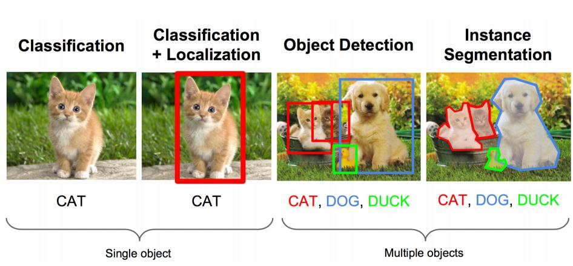
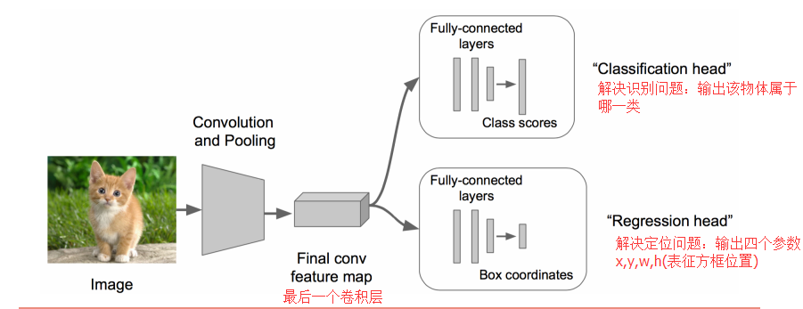

# Object Detection

目标检测就是在给定的图片中精确找到物体所在位置(x,y,w,h)（目标定位Localization），并标注出物体的类别（目标识别Classification）。其技术演进为：RCNN -> SppNET -> Fast-RCNN -> Faster-RCNN。单目标检测与多目标检测的操作的示例可由下图所示：

目标识别使用CNN就可以完成的很好了，定位有如下解决思路：

- **看作回归问题**：给定一张图片，需要预测(x, y, w, h)四个参数的值，从而得出方框的位置。这样目标检测的网络结构可由下图所示（缺陷：使用回归收敛时间需要非常长）：

- **看作分类问题**：取不同大小的框，让框出现在不同位置，得出框的得分，取得分最高的框。但对于如何选择合适的候选框是一个问题，常用如EdgeBoxes与Selective Search等。

## Selective Search

一种从图片中选出物体的候选框的算法，主要使用图像分割与区域生长技术（合并）。其思想在于只对图像中最有可能包含物体的区域进行搜索以此来提高计算效率，而且图像中物体可能存在的区域应该是有某些相似性或者连续性区域的。

算法步骤简述：首先，对输入图像进行分割算法产生许多小的子区域。其次，根据这些子区域之间相似性**（相似性标准主要有颜色、纹理、大小等等）**进行区域合并，不断的进行区域迭代合并。

## R-CNN

算法步骤：

- 在图像中确定约1000-2000个候选框 (使用选择性搜索)
- 每个候选框内图像块缩放至相同大小，并输入到CNN内进行特征提取 
- 对候选框中提取出的特征，使用分类器判别是否属于一个特定类
- 对于属于某一特征的候选框，用回归器进一步调整其位置

## **SPP Net**

DPP即Spatial Pyramid Pooling（空间金字塔池化）。其贡献主要有两个：

- 一般CNN后接全连接层或者分类器，全连接层或分类器都需要固定的尺寸，因此不得不对输入数据进行crop或者warp，这些预处理会造成数据的丢失或几何的失真。SPPNet的第一个贡献就是将金字塔思想加入到CNN，实现了数据的多尺度输入。
- 只对原图提取一次卷积特征：在R-CNN中，每个候选框先resize到统一大小，然后分别作为CNN的输入，这样是很低效的。 所以SPP Net根据这个缺点做了优化：只对原图进行一次卷积得到整张图的feature map，然后找到每个候选框在feature map上的映射patch，将此patch作为每个候选框的卷积特征输入到SPP layer和之后的层。节省了大量的计算时间，比R-CNN有一百倍左右的提速。

## Fast R-CNN

R-CNN的主要缺点：每一个候选框都要独自经过CNN，这使得花费的时间非常多。许多候选框（比如两千个）-->CNN-->得到每个候选框的特征-->分类+回归。

Fast R-CNN的解决方式：共享卷积层，现在不是每一个候选框都当做输入进入CNN了，而是输入一张完整的图片，在第五个卷积层再得到每个候选框的特征。一张完整图片-->CNN-->得到每张候选框的特征-->分类+回归。

其算法步骤如下：

- 在图像中确定约1000-2000个候选框 (使用选择性搜索)
- 对整张图片输进CNN，得到feature map
- 找到每个候选框在feature map上的映射patch，将此patch作为每个候选框的卷积特征输入到SPP layer和之后的层
- 对候选框中提取出的特征，使用分类器判别是否属于一个特定类 
- 对于属于某一特征的候选框，用回归器进一步调整其位置

## Faster R-CNN

Fast R-CNN存在的问题：存在瓶颈：选择性搜索，找出所有的候选框，这个也非常耗时。解决：加入一个提取边缘的神经网络，也就说找到候选框的工作也交给神经网络来做了。 做这样的任务的神经网络叫做Region Proposal Network(RPN)。

其算法步骤如下：

- 对整张图片输进CNN，得到feature map
- 卷积特征输入到RPN，得到候选框的特征信息
- 对候选框中提取出的特征，使用分类器判别是否属于一个特定类 
- 对于属于某一特征的候选框，用回归器进一步调整其位置

## 参考资料

- https://blog.csdn.net/small_munich/article/details/79595257
- https://www.cnblogs.com/skyfsm/p/6806246.html