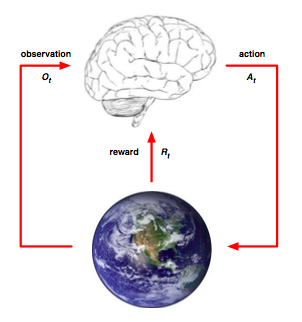

# 强化学习（reinforcement learning）

**强化学习RL是机器学习算法中的一大分支**。它的本质是**解决Decision Making问题**。使用它可以让计算机从一开始什么都不懂，通过不断的与环境**交互**，**试错**，**累积经验**，**学习经验**，最终学习到一个最优策略，这个策略可以在与环境的交互中获得很高的奖励。

## 发展历程

- 其首次被关注来源于Deepmind在2013年发表的使用DRL来玩Atari的论文：

> Mnih V , Kavukcuoglu K , Silver D , et al. Playing Atari with Deep Reinforcement Learning[J]. Computer Science, 2013.

- 接着2015年DeepMind在Nature上发表了使用DRL来玩Atari可以超越人的表现：

> Human-level control through deep reinforcement learning[J]. Nature, 2015, 518(7540):529-533.

- 2016年春天，基于RL的Alphago横扫人类棋手

## 模型概述

强化学习RL模型包含四个主要元素：**Agent**（智能体），**Environment**（智能体所处环境状态），**Action**（智能体每一步采取的动作），**Reward**（智能体每采取一个动作后环境的反馈），其模型架构如下：

强化学习RL模型的目标就是**获得最多的累计奖励**，上图大脑就是智能体（Agent），地球是环境（Environment），在每个时刻$t$:

- Agent要做的是：
  - 观察环境状态$O_t$
  - 计算环境反馈的奖励收益$R_t$
  - 做出行动$A_t$
- Environment要做的是：
  - 感知Agent的$A_t$
  - 做出环境反应$O_{t+1}$
  - 给出反馈$R_{t+1}$

### 存在的主要问题

强化学习RL模型中存在的主要问题包括：

- RL的奖励是**稀疏**与**延时**的，这带来的问题就是对于一次奖励如何合理地分配给之前的每一个动作，这被称为**信用分配问题（credit assignment problem）**。
- 另一个问题在于Agent要学会在**探索（exploration）**和**开发（exploitation）**之间做权衡，找出可以获得最大回报的决策。所谓探索，就是尝试一些新的不一样的方法，看看能不能获得更高的回报；所谓开发，就是尝试利用过去经验中最有效的行为来决策。

###  与监督学习对比

监督学习可以直接给出正确或错误的标签结果，强化学习没有确定的标签，它只给出一个环境反馈的奖励值，来说明这一步的好坏程度，且这个反馈可能还有**延时**。另一方面监督学习的输入很多时候是独立同分布的，而强化学习的决策是**呈链状**，每做出一个Action会影响下一次的Action的决定。

## 马尔科夫决策过程（MDP）

一般使用**马尔科夫决策过程**（MDP）来形式化**表述**和**推导**强化学习RL模型。

假设一个**个体(agent)**，处在**一个环境（environment）** 中（例如Breakout游戏）。这个环境在某一时刻$t$有一个确定的**状态（state ）**（例如球拍的位置，球的位置和角度，砖的数量和位置等等），个体可以做出一个特定的**动作（action）**（例如左移或者右移球拍）。这个动作会获得一个**奖励（reward）**（例如积分增加或积分减少），然后使环境转移到下一个状态，接着个体再次做出下一个动作，循环往复直到游戏结束。

动作可能有很多个，我们选择动作的规则称为**策略（policy）**。环境可能是随机的，这意味着下一个状态可能是随机的（比如Breakout游戏丢失一个球后，新开的球的位置和方向都是随机的）。

State, Action, Reward的转换构成了一个马尔科夫过程，其表示为一个序列：

> $s_0, a_0, r_1,...,s_{n-1}, a_{n-1}, r_n, s_n$

上面$s_i$表示第$i$步的环境状态，$a_i$表示Agent在第$i$步采取的动作，$r_{i+1}$表示执行这个动作后获得的环境反馈奖励。

马尔科夫决策过程的假设是**下一个状态$s_{i+1}$只取决于当前的状态$s_i$及采取的动作$a_i$，而与之前的状态和动作无关**（以下棋为例，下一步该怎么落子，仅仅观察当前的棋局做出决定就可以了，不需要关心是怎么走到当前这个地步的）。

### 奖励计算

在使用马尔科夫决策过程表征RL模型的基础上，可以计算出整个决策过程的奖励：

> $R=r_1+r_2+r_3...+r_n$

$t$时刻做出$a_t$后，未来的奖励可以表示为：

> $R_t=r_t+r_{t+1}+r_{t+2}+...+r_n$

但是我们实际算的时候，考虑到当前的动作对越远的未来影响会越小，故可以乘上一个$(0,1)$之间的折扣因子$\lambda$，最终$t$时刻的奖励可以表示为：

> $R_t=r_t+\lambda r_{t+1}+\lambda^2r_{t+2}+...+\lambda^{(n-t)}r_n$  
> $R_t=r_t+\lambda R_{t+1}$

上面第二个式子是第一个式子的递推式子。

### 状态价值函数（V函数）

有时候我们希望知道系统处于某一个状态的价值。假设当前系统使用策略$\pi$来选择动作，则状态价值函数可以表示为：

> $v_{\pi}(s)=\sum_a \pi(a|s)(R_s^a+\lambda\sum_{s'}P(s'|s,a)v_{\pi}(s'))$

上式中$\pi(a|s)$与$R_s^a$表示在状态s选择动作a的概率与可以获得的奖励，$P(s'|s,a)$表示在状态s选择动作a转移到状态s'的概率。

### 动作价值函数（Q函数）

为了衡量我们选择每一个动作的价值，我们定义动作价值函数，其可表示为：

> $q_{\pi}(s, a)=R_s^a+\lambda\sum_{s'}P(s'|s,a)\sum_{a'}\pi(a'|s')q_{\pi}(s', a')$

式子中相关值的含义与V函数一致。考虑V函数与Q函数合并到一起可以得到：

> $q_{\pi}(s, a)=R_s^a+\lambda\sum_{s'}P(s'|s,a)v(s')$

## 强化学习算法

按照理不理解所处的环境：

- Model-Free：不尝试理解环境， 环境给了什么就是什么。
- Model-Based：学会用过去的经验建立一个虚拟环境，能通过想象来预判断接下来将要发生的所有情况. 然后选择这些想象情况中最好的那种。

按照基于概率还是基于价值：

- Policy-Based：通过输出各个动作的概率来选择动作（注意：即使某个动作的概率最高, 也不一定会选到他；可以用概率分布在连续动作中选取特定动作）。
- Value-Based：输出所有动作的价值，选择价值最大的动作。

按照更新方式：

- Monte-Carlo update（回合更新）：回合更新指的是游戏开始后, 我们要等待游戏结束, 然后再总结这一回合中的所有转折点, 再更新我们的行为准则。
- Temporal-Difference update（单步更新）：单步更新则是在游戏进行中每一步都在更新, 不用等待游戏的结束, 即：边玩边学习，单步更新更有效率，用的较多。

按照是在线学习还是离线学习：

- On-Policy：所谓在线学习, 就是指我必须本人在场, 并且一定是本人边玩边学习。
- Off-Policy：离线学习是你可以选择自己玩, 也可以选择看着别人玩, 通过看别人玩来学习别人的行为准则。

## 参考文档

- [一文了解强化学习](https://blog.csdn.net/aliceyangxi1987/article/details/73327378)
- [揭开深度增强学习的神秘面纱](http://blog.sina.com.cn/s/blog_44befaf60102wh1p.html)
- [强化学习方法汇总 ](https://morvanzhou.github.io/tutorials/machine-learning/reinforcement-learning/1-1-B-RL-methods/)